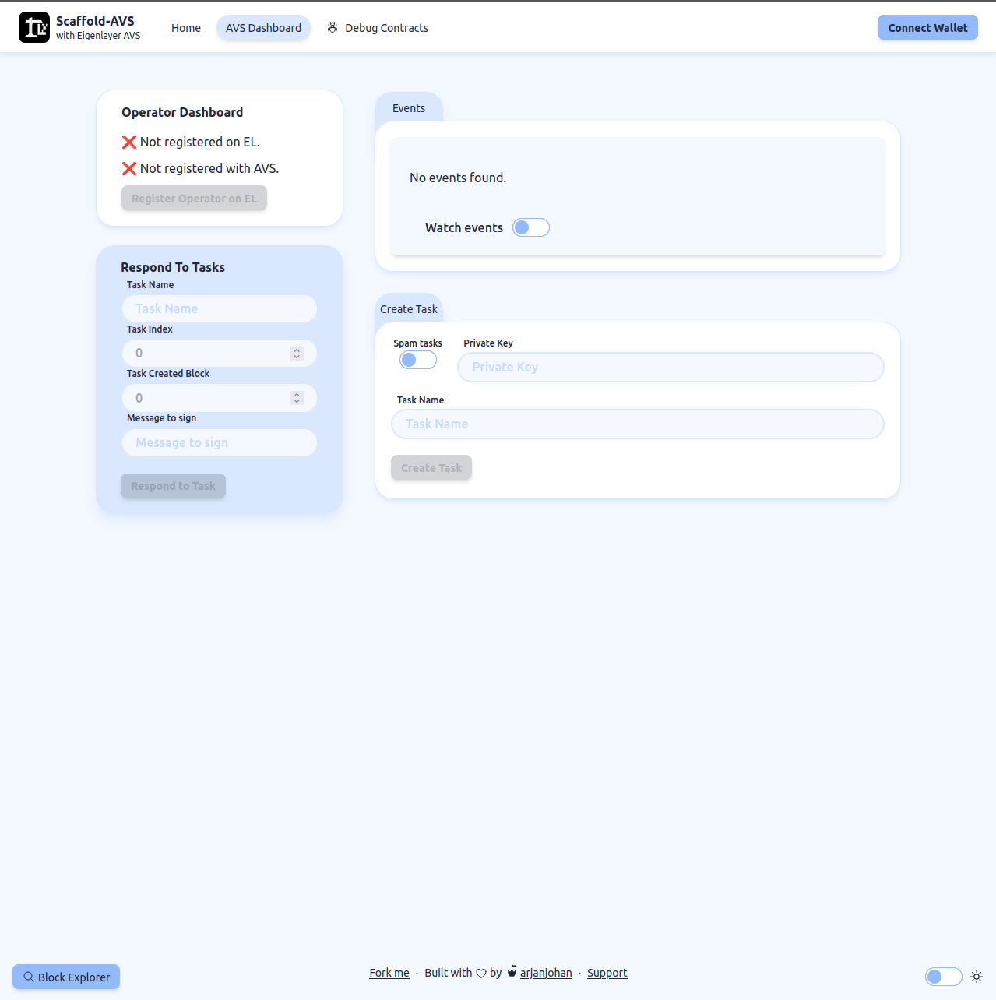
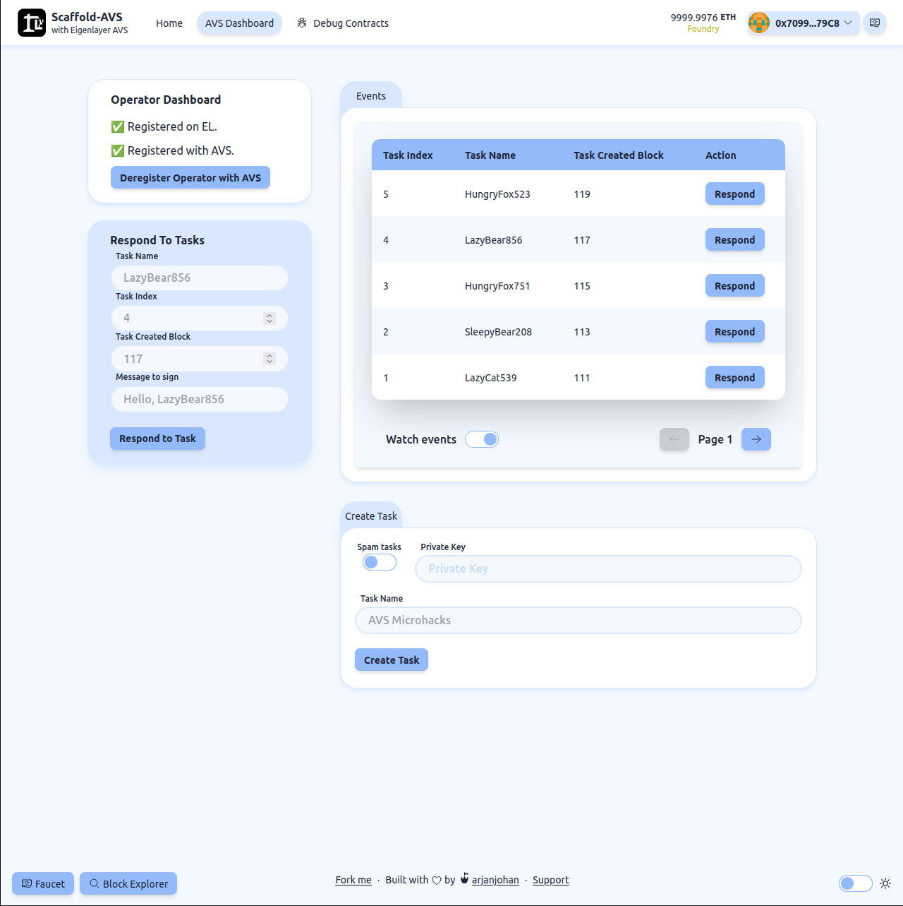
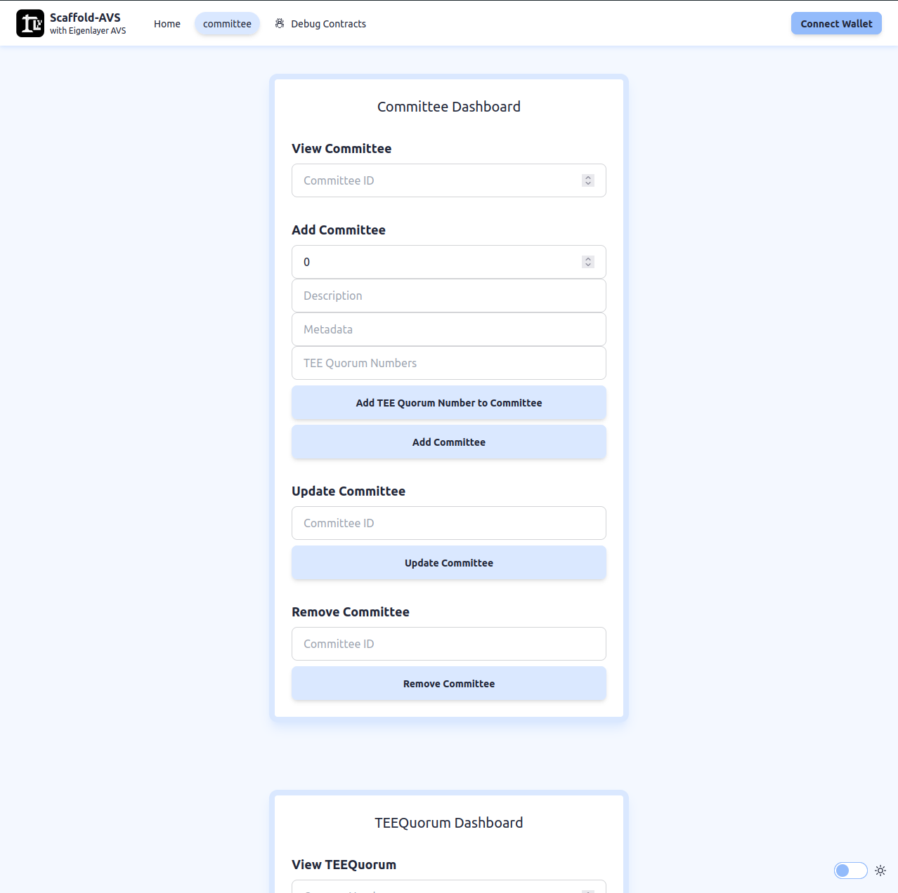
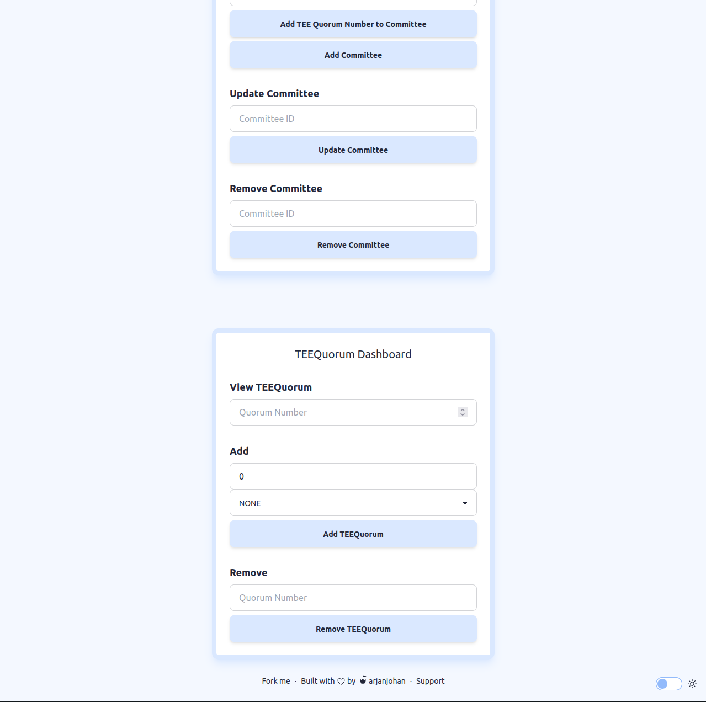

# 🏗 Scaffold-AVS

<div align="center">

  
  <h4>
    <a href="https://scaffold-avs.vercel.app/">Website</a> |
    <a href="https://github.com/arjanjohan/scaffold-avs">Repo</a>
  </h4>
</div>

🔧 Scaffold-AVS is an open-source toolkit for building your own Eigenlayer AVS. This repository is designed to make it easier for any developer to create and deploy AVS smart contracts and build user interfaces that interact with those AVS contracts. This repository includes the [Hello World AVS](https://github.com/Layr-Labs/hello-world-avs) contracts and an intuitive frontend dashboard to interact with this AVS. It's easy to create a new AVS contracts and setup similar dashboards quickly.

⚙️ Built using Eigenlayer, NextJS, RainbowKit, Foundry, Wagmi, Viem, and Typescript.

- ✅ **Contract Hot Reload**: The frontend auto-adapts to your smart contract as you edit it.
- 🪝 **Scaffold hooks**: Collection of React hooks wrapper around [wagmi](https://wagmi.sh/) to simplify interactions with smart contracts with typescript autocompletion.
- 🧱 **Components**: Collection of common web3 components to quickly build your frontend.
- 🔐 **Integration with Wallet Providers**: Connect to different wallet providers and interact with the AVS smart contracts.

## Screenshots

| Empty dashboard                   | Live dasboard                     |
| --------------------------------- | --------------------------------- |
|  |  |

| Multi-Prover AVS Committee dashboard                   | Multi-Prover AVS Quorum dasboard                     |
| --------------------------------- | --------------------------------- |
|  |  |

## Functions

This dApp uses the Hello World AVS smart contracts, which includes the most basic functionalties that your AVS will probably also have. Use the Hello World AVS, or deploy your own contracts, and interact with them on your frontend dashboard. Here's an overview of all functions to interact with the AVS via the dashboard. If you want to add more, you can modify the frontend or interact with the AVS contracts via the `Debug` tab.

#### Register as operator with Eigenlayer and AVS
The first component checks if the connected wallet is registered with Eigenlayer and the AVS. Use the button to register or deregister.

#### Create task
This component is used to send a new task to the AVS. Connect your wallet to send a single task, or input your private keys and have the dApp send a task every 5 seconds.

#### Monitor tasks
The events component displays all tasks. Use the `Watch Tasks` toggle to get live updates for new tasks. By clicking the `Respond` button, the task information is copied to the Respond component fields.

#### Respond to tasks
This component is used to respond to task. Manually input the task information and response, or click the `Respond` button in the Tasks monitor to autofill for a specific task. This is only available for registered operators.

## Requirements

Before you begin, you need to install the following tools:

- [Node (>= v18.17)](https://nodejs.org/en/download/)
- Yarn ([v1](https://classic.yarnpkg.com/en/docs/install/) or [v2+](https://yarnpkg.com/getting-started/install))
- [Git](https://git-scm.com/downloads)
- [Foundry](https://getfoundry.sh/)
- [Docker](https://www.docker.com/get-started/)

## Quickstart

To get started with Scaffold-AVS, follow the steps below:

1. Install dependencies:

```
cd scaffold-avs
yarn install
```

2. Make sure Docker is running

3. Run a local network in the first terminal:

```
make start-chain-with-contracts-deployed
```

This command starts a local Ethereum network using Foundry. The network runs on your local machine and can be used for testing and development. You can customize the network configuration in `packages/foundry/foundry.toml`.

4. Update the submodules

```
git submodule update --init --recursive
```

5. On a second terminal, deploy the test contracts:

```
yarn deploy
```

This command deploys a test smart contract to the local network. The contract is located in `packages/foundry/contracts` and can be modified to suit your needs. The `yarn deploy` command uses the deploy script located in `packages/foundry/script` to deploy the contract to the network. You can also customize the deploy script.

6. On a third terminal, start your NextJS app:

```
yarn start
```

Visit your app on: `http://localhost:3000`. You can interact with your smart contract using the `Debug Contracts` page. You can tweak the app config in `packages/nextjs/scaffold.config.ts`.

7. Sign in as the operator and register with Eigenlayer and AVS on the frontend. Now you can create tasks (using any wallet) and respond to them (with a wallet registered as operator).

**What's next**:
- Edit your smart contract `HelloWorldServiceManager.sol` in `packages/foundry/contracts`
- Edit your frontend homepage at `packages/nextjs/app/page.tsx`. For guidance on [routing](https://nextjs.org/docs/app/building-your-application/routing/defining-routes) and configuring [pages/layouts](https://nextjs.org/docs/app/building-your-application/routing/pages-and-layouts) checkout the Next.js documentation.
- Edit your deployment scripts in `packages/foundry/script`

## Next steps

This project is still in progress, and here some of the things I want to add after the hackathon:

- Fix Signature errors when registering with AVS
- Migrate project to hardhat

Contributions to the project are welcome.

## Links

#### Presentation
- [Presentation slides](https://docs.google.com/presentation/d/1MgMPbaSvr20rSifje4u8RtqtHeWIjONWLD1osXHUlWw/edit?usp=sharing)
- [Presentation video](https://www.loom.com/share/173137d483804ab0a806b3560fb40721?sid=c8f5985c-44d5-475e-bcf5-1d56d9a84daa)

#### Deployment
- [Vercel deployment (requires local chain running)](https://scaffold-avs.vercel.app/)
- [Vercel deployment Scaffold-AVS with Multi-Prover AVS (on Holesky)](https://scaffold-multi-prover-avs.vercel.app/)

#### Tutorials
- [Medium article 1: Migrate your AVS contracts over to a Scaffold-AVS repo](https://medium.com/@arjanjohan/migrate-your-avs-contracts-over-to-a-scaffold-avs-repo-3c3f8cbf9488)
- [Medium article 2: Setting up your AVS dashboard with Scaffold-AVS](https://medium.com/@arjanjohan/setting-up-your-avs-frontend-dashboard-with-scaffold-avs-733893366697)

#### Github
- [Github](https://github.com/arjanjohan/scaffold-avs)
- [Github branch for Multi-Prover AVS dashboard](https://github.com/arjanjohan/scaffold-avs/tree/multi-prover-avs)

## Team

- [arjanjohan](https://x.com/arjanjohan/)
